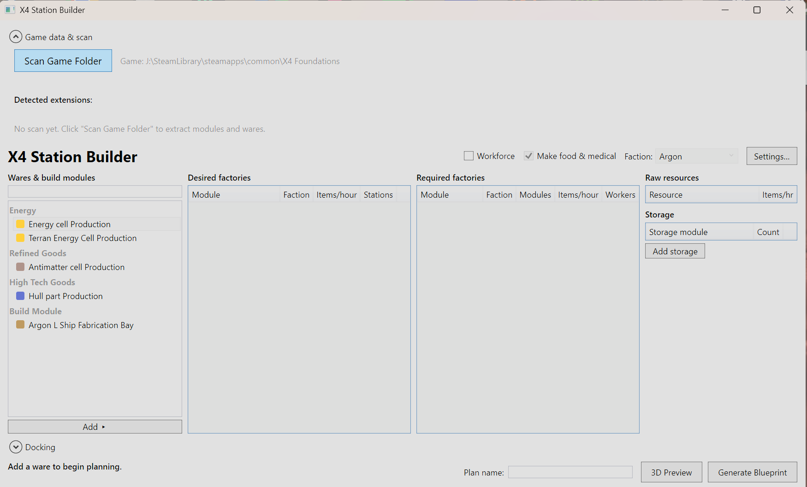
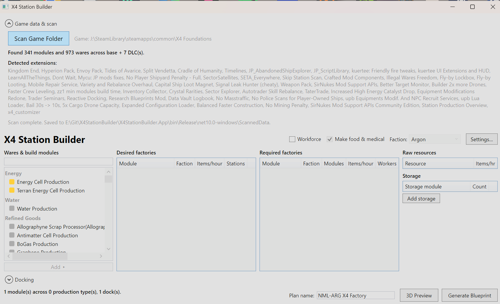
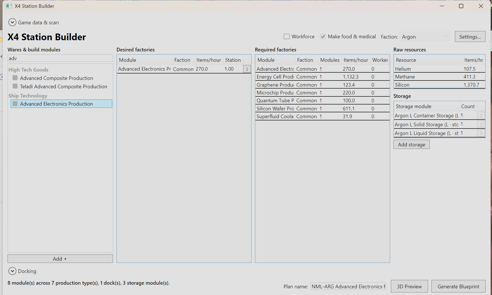
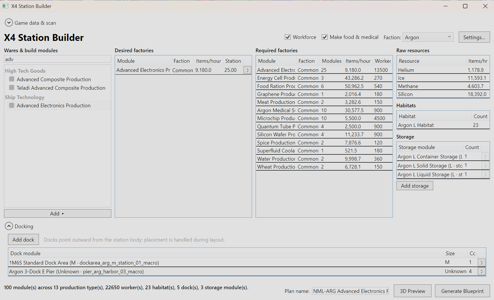
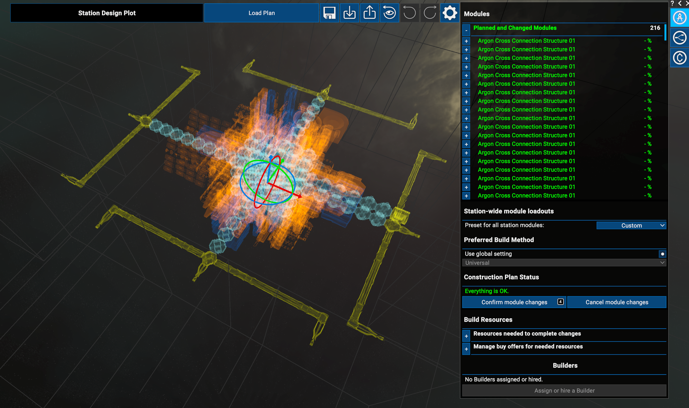
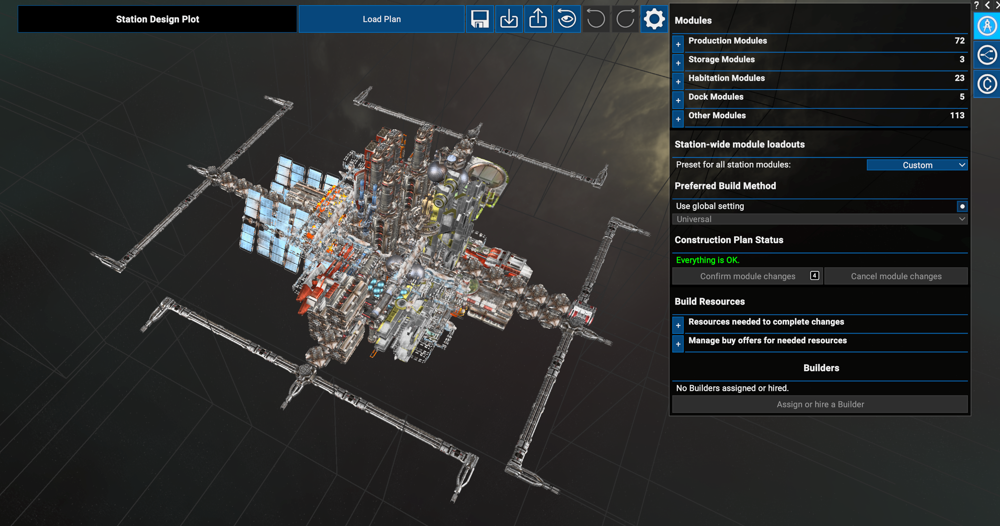

# X4 Station Builder

A Windows desktop tool for planning and building stations in
[**X4: Foundations**](https://www.egosoft.com/games/x4/info_en.php) — scan your own
game install, work out production chains, lay out modules, and export a blueprint you
can import back into the game.

> ⚠️ **Work in progress.** This is a hobby project that gets worked on *when inspiration
> and spare time align*. Expect rough edges, missing features, and breaking changes.
> It is not feature-complete and may not be at any particular point in time.

## About

X4 Station Builder reads the data from your existing X4: Foundations installation
(including detected DLCs/extensions) and helps you design a station around it. Instead of
guessing how many production modules, storage, and workforce habitats you need, the tool
parses the game's wares and modules and does the math for you.

Because it works directly from your installed game files, it stays in sync with the wares
and modules that are actually available to you — including DLC content — rather than a
hardcoded snapshot.

## Features

- **Game-folder scanning** — mounts the game's CAT/DAT archives and parses wares and
  station modules straight from your install.
- **DLC / extension aware** — detects installed expansions and merges their data into the
  catalog.
- **Production planning** — calculates production chains and the modules needed to meet a
  target output, including intermediate wares.
- **Storage & workforce planning** — works out storage requirements and habitat/workforce
  needs (with per-species housing).
- **Station layout** — arranges chosen modules into a buildable station layout.
- **3D preview** — visualize the planned station in 3D (powered by HelixToolkit).
  > 📝 **Note:** The 3D viewer is currently very bare bones and may not be developed further.
- **Blueprint export** — export the design as station blueprint XML.

## Requirements

- **Windows** (this is a WPF application).
- **[.NET 10 SDK](https://dotnet.microsoft.com/download)** (target framework
  `net10.0-windows`).
- A legitimate installation of **X4: Foundations**. The app ships **no** game data — it
  reads from your own install.

## Building & Running

Clone the repository and build/run with the .NET CLI:

```bash
git clone https://github.com/Glorblach/X4StationBuilder.git
cd X4StationBuilder

# Build the whole solution
dotnet build

# Run the desktop app
dotnet run --project X4StationBuilder.App
```

You can also open `X4StationBuilder.slnx` in Visual Studio (2022/2026 with .NET 10 support)
and run the `X4StationBuilder.App` project.

### Running tests

```bash
dotnet test
```

## How it works — a quick walkthrough

This example builds an **Advanced Electronics** factory from scratch.

### 1. Scan your game install

When you first launch the app, no game data is loaded yet. Open the **Game data & scan**
section, point it at your X4: Foundations folder, and click **Scan Game Folder**.



After the scan finishes, the tool reports how many modules and wares it found and lists the
DLCs and extensions it detected. The wares and build modules list on the left is now
populated and ready to use.



### 2. Pick what you want to produce

Search for and add the ware you want to build (here, **Advanced Electronics**). The tool
immediately calculates the **required factories**, the modules needed, the **raw resources**
consumed, and suggested **storage** — all from the wares you picked.



Scale up your target output and toggle options like **Workforce** and **Make food &
medical**. The plan recalculates everything for you — production modules, intermediate
goods, habitats, workers, storage, and docks — and you can name the plan at the bottom.



### 3. Export and build in-game

Click **Generate Blueprint** to export the plan as station blueprint XML, then import it
into X4: Foundations from the **Station Design Plot**. The game loads all the planned
modules ready to confirm and build.



Confirm the module changes and your fully planned station is ready to construct.



## Project structure

| Project | Description |
| --- | --- |
| `X4StationBuilder.Core` | Domain logic: archive reading, DLC detection, ware/module parsing, production calculation, storage/workforce/layout planning, blueprint export. |
| `X4StationBuilder.App` | WPF UI (MVVM via CommunityToolkit.Mvvm) with a 3D station preview (HelixToolkit.Wpf). |
| `X4StationBuilder.Tests` | Unit tests for the core services. |

## Disclaimer

This is an unofficial, fan-made tool and is **not affiliated with, endorsed by, or
associated with Egosoft**. *X4: Foundations* and all related names, marks, and assets are
the property of their respective owners. You must own and have X4: Foundations installed
to use this tool.
